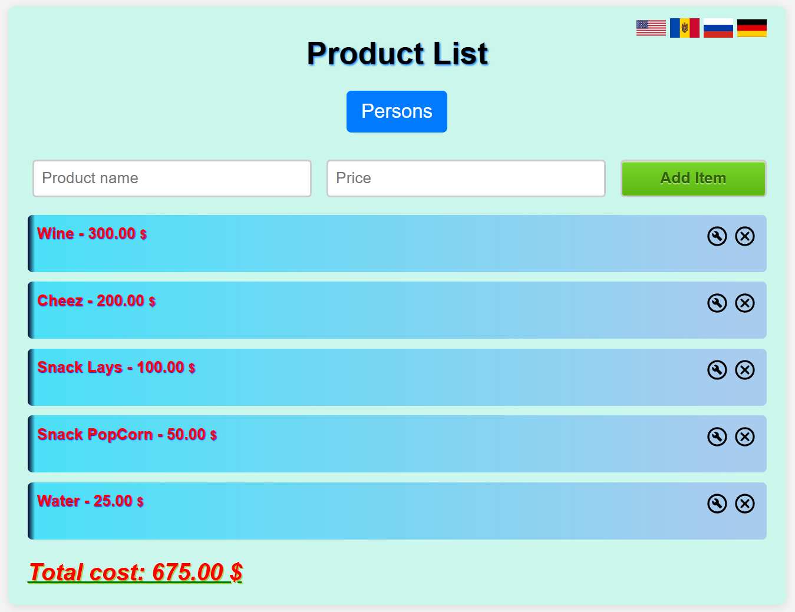
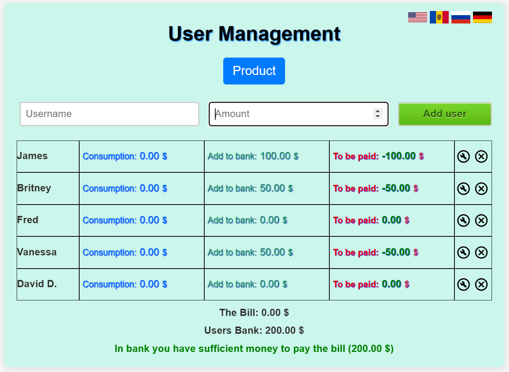
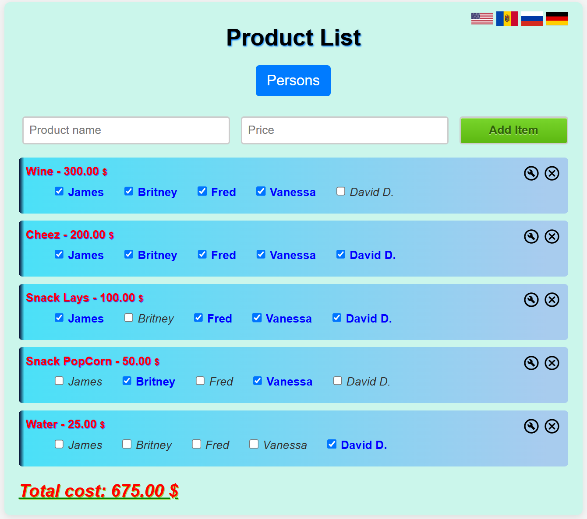
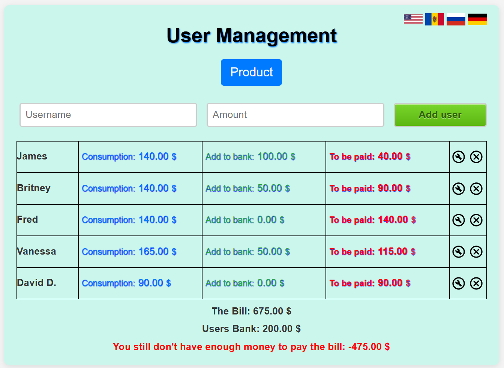

Hi,
This is my app, where you can split the bill between friends in restaurant, party outside or at home.
First, add product list that you bought and the price per each product (food, drinks)
Then you go to Users page and creat the user who was at the party and (if he bought something) write amount of money that he spend (if he spend nothing, then write "0")
After this you need to go to product list page and each user have to select the product that he eat or drink.
And the results you can find per each user in User Management page, how much each have to pay (or add to the bank if it was a party outside or at home).

Instruction:
1. In page "Products" creat product and it's cost.

2. In page "Users" creat users and how much he spend.
   

3. Then go back to page "Products" and select what product did user X consume.
   

4. After this, in page "Users", you can see how much each of user must pay for that what he eat or drink.
   